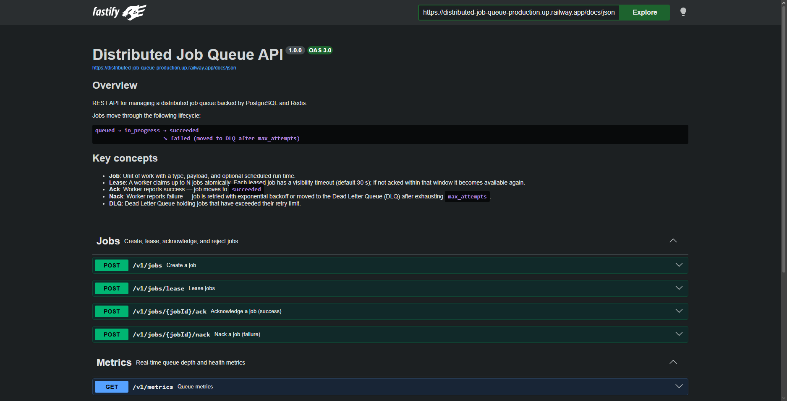
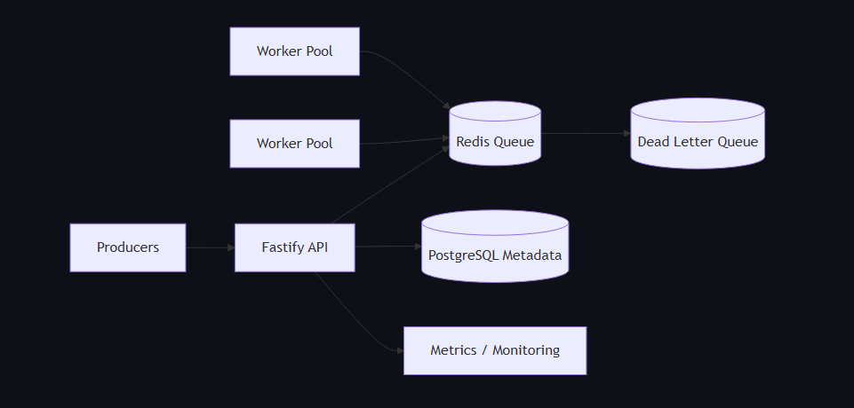
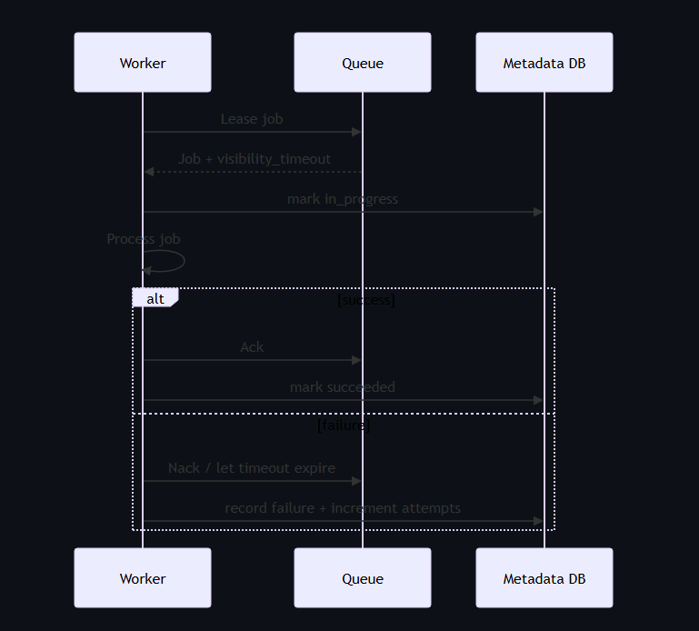
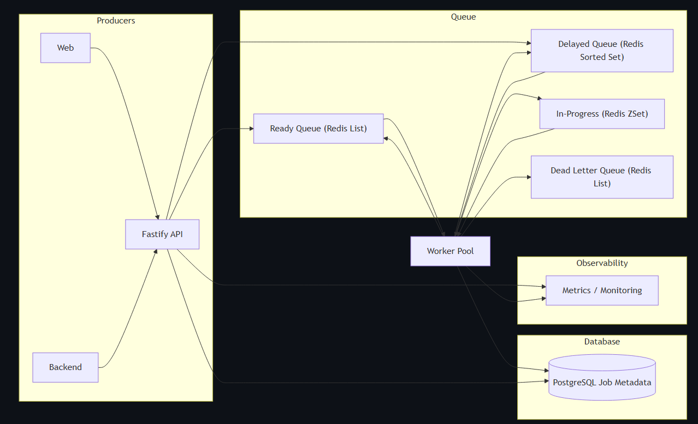

# Distributed Job Queue Service


Production-ready distributed job queue backend built with **Node.js**, **TypeScript**, **Fastify**, **PostgreSQL**, **Redis**, and **Prisma**.

This project is designed as a **backend engineering portfolio project** demonstrating scalable distributed system patterns.

---

## Overview

Distributed Job Queue Service provides:

* Job ingestion via API
* Job validation and scheduling
* Redis-based queue with delayed jobs and retries
* Dead-letter queue for poison jobs
* Asynchronous job processing worker
* Dockerized local development and deployment
* GitHub Actions CI pipeline
* Railway deployment
* OpenAPI documentation with Swagger UI

---

## Live API

[](http://https://distributed-job-queue-production.up.railway.app/docs)
[](http://https://distributed-job-queue-production.up.railway.app/health)

### Swagger UI


---

## System Design Reference

This implementation follows the distributed job queue architecture described in the system design repository:

[https://github.com/marcos-astudillo/system-design-notes](https://github.com/marcos-astudillo/system-design-notes)

The goal is to demonstrate how a **system design document can be translated into a production-style backend implementation**.

---

## Architecture

1. Producers send jobs via `/v1/jobs` API.
2. API validates and enqueues jobs into Redis.
3. Worker leases jobs asynchronously.
4. Worker processes jobs and updates PostgreSQL metadata.
5. Metrics can be queried via `/v1/metrics` API.
6. Jobs remain stored for replay, retries, and DLQ handling.

### High-level flow

```text
Producers (web, backend)
        |
        v
Fastify API
  |-----------------------> PostgreSQL (job metadata)
  |
  |-----------------------> Redis (ready/delayed queue)
  |
  '-- Worker consumes queue --> processes jobs --> updates DB
```

## Tech Stack

* Runtime: Node.js
* Language: TypeScript
* Framework: Fastify
* ORM: Prisma
* Database: PostgreSQL
* Cache / Queue: Redis
* Background Jobs: Node worker
* Testing: Vitest
* Containerization: Docker + Docker Compose
* CI: GitHub Actions
* Deployment: Railway

---

## Project Structure

### Architecture Diagram


### Worker Job Flow


### Job Queue Flow


```text
distributed-job-queue/
├── src/
│   ├── controllers/
│   ├── services/
│   ├── repositories/
│   ├── models/
│   ├── routes/
│   ├── config/
│   ├── server.ts
│   └── worker/worker.ts
├── prisma/
├── tests/
│   ├── unit/
│   ├── integration/
│   └── e2e/
├── docker/
│   ├── api/
│   └── worker/
├── .github/workflows/
├── docker-compose.yml
├── package.json
├── README.md
└── docs/images/
```

---

## Main Features

### 1. Job ingestion

Accepts jobs via API.

#### Endpoint

```text
POST /v1/jobs
```

#### Request body

```json
{
  "type": "send_email",
  "payload": { "to": "test@test.com" },
  "run_at": "2026-03-30T12:00:00Z"
}
```

#### Response

```json
{
  "job_id": "cmndmy7kv00004t70ln637nxu",
  "type": "send_email",
  "payload": { "to": "test@test.com" },
  "state": "queued",
  "attempts": 0,
  "max_attempts": 3,
  "created_at": "2026-03-30T20:23:31.807Z",
  "updated_at": "2026-03-30T20:23:31.807Z"
}
```

### 2. Job Leasing and Processing

* Workers lease jobs with visibility timeout.
* Retry with exponential backoff.
* DLQ for failed jobs after max attempts.

#### Endpoints

```text
POST /v1/jobs/lease?worker_id=w1&limit=10
POST /v1/jobs/{job_id}/ack
POST /v1/jobs/{job_id}/nack
```

### 3. Metrics

* Queue depth, delayed jobs, in-progress jobs, DLQ

#### Endpoint

```text
GET /v1/metrics
```

Response example:

```json
{
  "queue": {
    "ready": 10,
    "delayed": 2,
    "in_progress": 3,
    "dlq": 1
  }
}
```

### 4. Health Checks

#### Endpoint

```text
GET /health
```

#### Response

```json
{
  "status": "ok",
  "service": "distributed-job-queue",
  "checks": {
    "database": "up",
    "redis": "up"
  }
}
```

### 5. Production-ready Features

* Feature flags for optional behaviors
* Async job processing with retries and DLQ
* Graceful shutdown for API and worker
* Dockerized services
* GitHub Actions CI workflow
* OpenAPI / Swagger documentation
* Metrics for observability

---

## Local Development

1. Install dependencies:

```bash
npm install
```

2. Configure environment variables:

```bash
cp .env.example .env
```

3. Start infrastructure:

```bash
docker compose up -d postgres redis
```

4. Run migrations:

```bash
npx prisma migrate dev --name init
```

5. Start API:

```bash
npm run dev
```

6. Start worker:

```bash
npm run worker:dev
```

7. Open Swagger UI:

```text
http://127.0.0.1:3000/docs
```

---

## Docker

Build and run full stack:

```bash
docker compose up --build
```

This starts:

* API
* Worker
* PostgreSQL
* Redis

Useful commands:

```bash
docker compose down
npm run build
npm run typecheck
```

---

## Testing

Unit, integration, and e2e tests with Vitest.

```bash
npm run test:unit
npm run test:integration
npm run test:e2e
npm run test:run
```

---

## CI (GitHub Actions)

Runs:

* Dependency install
* Prisma generate
* Migrations
* Typecheck
* Unit & Integration tests

---

## Deployment Notes

Deploys cleanly on Railway with four services:

* API
* Worker
* PostgreSQL
* Redis

API start command:

```bash
sh -c "npx prisma migrate deploy && node dist/server.js"
```

Worker start command:

```bash
sh -c "npx prisma migrate deploy && node dist/worker/worker.js"
```

## Scalability Considerations

* Async job processing keeps API latency low
* Redis queue ensures durability and retry logic
* Separation of API and Worker isolates background jobs
* Feature flags configurable without code changes
* Graceful shutdown
* Dockerized services for consistency
* Typed schemas + CI for maintainability
* Metrics endpoints for observability

---

Connect With Me

<p align="center">
    <a href="https://www.marcosastudillo.com">
        
    </a>
    <a href="https://www.linkedin.com/in/marcos-astudillo-c/">
        
    </a>
    <a href="https://github.com/marcos-astudillo/distributed-job-queue">
        
    </a>
    <a href="mailto:m.astudillo1986@gmail.com">
        
    </a>
</p>
